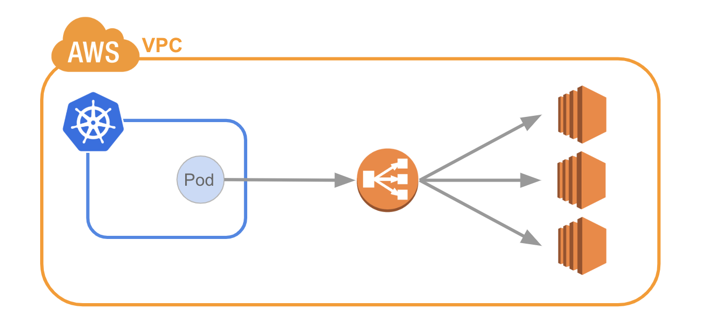
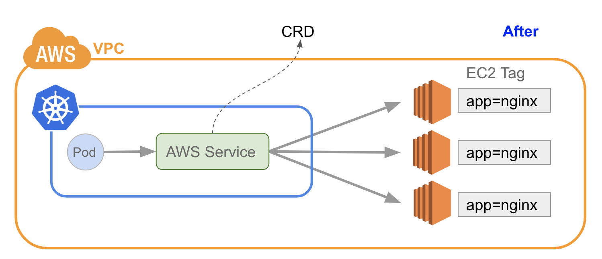

# AWS Service Controller

NOTE: This is just a practice for developing a Kubernetes controller. Not for production.

## Purpose

Create a Kubernetes Service for AWS EC2 private IPs. 

You might be familiar with the scenario below which an AWS user mixing Kubernetes with VM-base apps.



The concept is using a CRD, AWSService as a L4 proxy against AWS EC2 instances. 
So that we can expand our service mesh scope not only in the Kubernetes cluster but AWS EC2 instances.



## Setup

NOTE: the `aws-svc-controller` must have the AWS permissions to list and describe EC2 instances.

```shell
# will create a namespace, aws-system. and run a controller pod inside.
$ kubectl apply -f aws-svc-controller.yaml
```

## Use

```shell
# Create an AWSService
$ cat <<EOF | kubectl apply -f -
apiVersion: earou.io/v1
kind: AWSService
metadata:
  name: ec2-foo-svc
spec:
  port: 80
  targetPort: 80
  selector:
    awsTagName: ec2/app
    awsTagValue: foo
EOF

# Check status
$ kubectl get awsservice,svc,ep
```

## Local Dev Test

Prepare CRD at your k8s cluster.
```shell
$ kubectl apply -f crd.yaml
```

Run controller at local.
```shell
$ docker run --rm -d \
    -e AWS_REGION={ aws access key } \
    -e AWS_ACCESS_KEY_ID={ aws access key } \
    -e AWS_SECRET_ACCESS_KEY={ aws secret key } \
    -e KUBE_HOST={ kubernetes api server host } \
    -e TOKEN={ service account token for aws-svc-controller } \
    earou/aws-svc-controller:latest
```